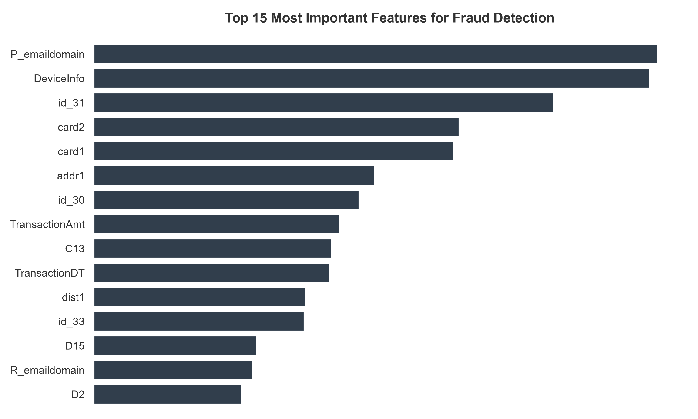

# Real-Time E-Commerce Fraud Detection API 🛡️💳

Bu proje; milyonlarca işlem içeren büyük ölçekli ve yüksek sınıf dengesizliğine (class imbalance) sahip e-ticaret verileri üzerinde, gerçek zamanlı fraud tespiti yapabilen production-grade bir mikroservis mimarisidir. 

Laboratuvar ortamındaki maskelenmiş verilerin aksine; gerçek dünyada karşılaşabileceğiniz cihaz türleri, lokasyon verileri, kart bilgileri ve e-posta uzantıları gibi ham features'ı işleyen uçtan uca bir makine öğrenmesi pipeline'ı kurgulanmıştır.

---

## 📈 Model Performansı & İş Mantığı 

Sistem, dürüst veri simülasyonu sağlayan bağımsız test grubu üzerinde yapılan batch değerlendirmede aşağıdaki kararlı sonuçları üretmiştir:

* **Genel Doğruluk (Accuracy):** `%91.40`
* **Duyarlılık / Yakalama Oranı (Recall):** `%85.71`
* **Kesinlik (Precision):** `%12.50`

### Metriklerin Finansal Karşılığı ve Karar Eşiği (Threshold) Stratejisi
Finansal sahtekarlık modellerinde temel amaç mali kayıpları (chargeback) engellemektir. **%85.71 Recall** oranı, sistemin gerçekleşen her 100 dolandırıcılık girişiminin yaklaşık 86'sını canlı ortamda başarıyla bloke ettiğini gösterir. 

Elde edilen **%12.50 Precision** değeri, modelin şüpheli olarak işaretlediği her 8 işlemden 1'inin gerçek fraud, geri kalan 7'sinin ise masum işlemler (False Positive) olduğunu belirtir. Bu davranış, production ortamında bir **"Yumuşak Engel" (Soft-Block / 3D Secure / SMS OTP yönlendirmesi)** mekanizması olarak kurgulanmıştır. Bankacılık ve e-ticaret sektör standartlarında, gerçek bir dolandırıcılığı kaçırmaktansa, masum müşterilere ek bir güvenlik doğrulaması (SMS kodu) göndermek finansal risk yönetimi açısından en optimum yaklaşımdır.

<p align="center">
  
</p>
---

## 🛠️ Öne Çıkan Mühendislik Pratikleri

* **Akıllı Bellek ve Donanım Optimizasyonu:** `LightGBM` mimarisi histogram tabanlı veri bükme (binning) yöntemiyle eğitilmiştir. Eğitim boru hattına entegre edilen çöp toplayıcı (`gc.collect()`) sayesinde, 700MB+ boyutundaki devasa tablolar RAM darboğazı yaratmadan kısıtlı donanımlarda bile hızlıca işlenebilir. Sınıf dengesizliği çözümü için ağır SMOTE algoritmaları yerine dahili `is_unbalance=True` parametresi kullanılarak CPU yükü minimize edilmiştir.
* **Dinamik Şema Hizalama Katmanı (Dynamic Schema Reindexing):** Canlı sisteme gelen anlık JSON istekleri, eğitim setindeki 431 adet özelliğin tamamını içermese bile, `app.py` üzerindeki şema güvenlik katmanı eksik sütunları anında tespit eder, eğitim sırasına göre yeniden dizer ve `None` (null) değerlerle güvenli şekilde tamamlar.
* **Ağaç Tabanlı Tip Güvenliği (Type Coercion):** JSON serileştirmeden kaynaklanan tip kaymalarını önlemek amacıyla API katmanında; kategorik değişkenler otomatik olarak Pandas `category` tipine, sayısal alanlar ise dinamik olarak `pd.to_numeric` ile saf numerik tiplere zorlanarak LightGBM tahmin motorunun çökmesi engellenir.

---

🚀 Kurulum ve Çalıştırma Talimatları
1. Bağımlılıkların Yüklenmesi
Projeyi çalıştırmak için öncelikle bir sanal ortam oluşturun ve gerekli kütüphaneleri yükleyin:

# Sanal ortam oluşturma
```python -m venv fraud_env```

# Sanal ortamı aktif etme (Windows)
```fraud_env\Scripts\activate```

# Sanal ortamı aktif etme (Linux / MacOS)
```source fraud_env/bin/activate```

# Gerekli bağımlılıkları yükleme
```pip install -r requirements.txt ```

2. Veri Setinin Temini
Kaggle ve Vesta Corporation lisans kısıtlamaları ile GitHub dosya boyutu limitleri sebebiyle ham veri setleri bu depoda yer almamaktadır.

Kaggle IEEE-CIS Fraud Detection yarışma sayfasına gidin.

Kuralları kabul ettikten sonra train_transaction.csv ve train_identity.csv dosyalarını indirin.

İndirdiğiniz dosyaları sıkıştırılmış klasörlerden çıkararak direkt olarak projenin kök dizinine yerleştirin.

3. Modelin Eğitilmesi ve Serileştirilmesi (Serialization)
Ham verileri SQL mantığıyla birleştiren, kategorik şemayı çıkaran ve modeli eğiten betiği çalıştırın:

```python train.py```

Bu işlem sonucunda ana dizinde ieee_fraud_model.pkl, categorical_columns.pkl ve feature_names.pkl dosyaları üretilecektir.

4. Canlı Mikroservisin (FastAPI) Başlatılması
Üretilen model nesnelerini RAM'e yükleyerek istek kabul etmeye hazır asenkron API sunucusunu ayağa kaldırın:

```uvicorn app:app --host 0.0.0.0 --port 8000```

Terminalde Application startup complete. ibaresini gördüğünüzde API canlıya alınmış demektir.

5. API ve QA Testlerinin Koşturulması
Uvicorn sunucusu arka planda çalışmaya devam ederken, yeni bir terminal sekmesi açarak QA test araçlarını tetikleyebilirsiniz:

Dürüst Toplu Doğruluk Testi: Eğitimde modelin hiç görmediği temiz bir veri diliminden (skiprows katmanı ile) 500 adet işlem çekip konfüzyon matrisini yazdırmak için:

```python test_accuracy.py```

Performans ve Yük Testi: Sisteme ardışık 1000 adet e-ticaret JSON paketi göndererek milisaniye bazında yanıt gecikmesini (latency) ölçmek için:

```python test_api.py```

📝 API Uç Noktası (Endpoint) Şeması
POST /predict
İstemciden (Client) gelen karmaşık e-ticaret logunu değerlendirerek anında karar üretir.

Örnek İstek Gövdesi (Payload):

```JSON
{
  "TransactionAmt": 150.00,
  "ProductCD": "W",
  "card1": 13926,
  "card4": "discover",
  "card6": "credit",
  "P_emaildomain": "gmail.com",
  "DeviceType": "mobile",
  "DeviceInfo": "SAMSUNG"
}

//Örnek API Yanıtı (Response):

{
  "transaction_id": "req-ieee-realtime",
  "status": "approved",
  "fraud_probability": 0.0412
}
```
📄 Lisans
Bu proje altındaki tüm kaynak kodlar MIT Lisansı ile dağıtılmaktadır. Eğitimde kullanılan veri setinin mülkiyet hakları Vesta Corporation ve IEEE-CIS topluluğuna aittir.
